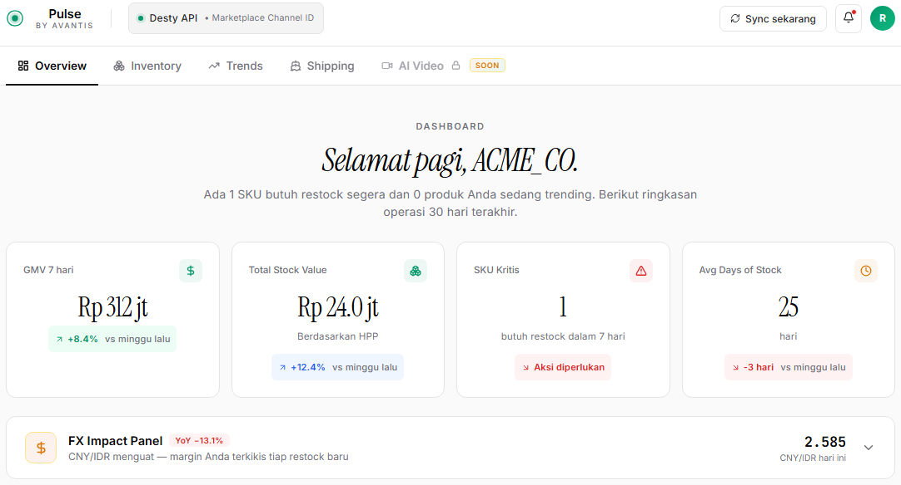
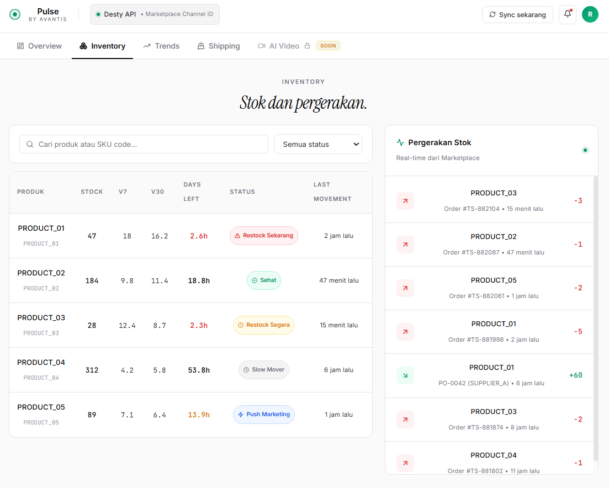
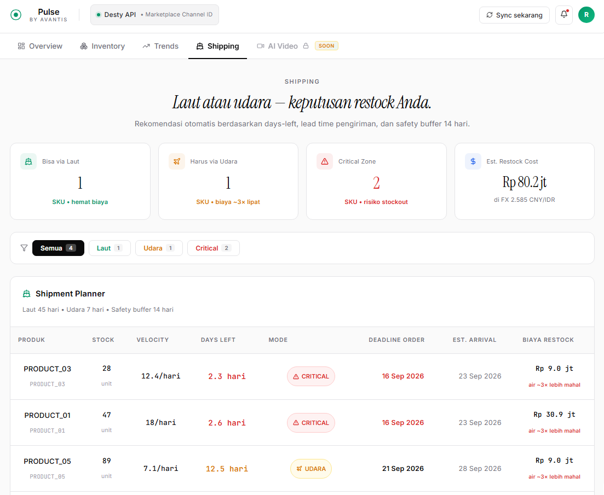

# Pulse

An inventory and margin dashboard for Indonesian TikTok Shop sellers who import stock from China — tracks true landed cost per SKU as the CNY/IDR rate moves, and tells you what to restock, how much to budget, and whether to ship it by sea or air.

## Screenshots

<!-- TODO: add screenshots -->




## The problem

Sellers in this segment quote margin off a single exchange rate snapshot, usually whatever CNY/IDR rate they last checked. That's the wrong number to plan around. By the time a restock order clears customs, the landed cost per unit has moved because of the FX rate at time of purchase, TikTok Shop's commission, ad spend, packaging, and freight — and freight in particular swings 3x depending on whether the order ships by sea or air, which itself is a function of how many days of stock are left versus how long each shipping mode takes.

Pulse models landed cost as a function of all of those inputs together, not just FX, and turns it into two decisions a seller actually has to make every day: what to restock now, and whether it still qualifies for cheap sea freight or has to go by air.

## Stack

- React 19 + Vite 8
- Recharts for the FX history, velocity, and GMV charts
- lucide-react for icons
- Inline styles throughout (no CSS framework) — plain JS objects, no styled-components/Tailwind
- ESLint 10 (flat config) for linting

No backend, no routing, no state management library — everything lives in `useState`/`useMemo` in a single-page component tree (`src/App.jsx`).

## Key implementation details

- **FX-aware margin erosion.** Each SKU carries its cost basis in CNY (`hppCNY`). The FX Impact Panel recomputes landed cost in IDR at three points in time (today, 30 days ago, 365 days ago) and shows the resulting margin erosion per SKU in percentage points — so "the rupiah weakened 13% YoY" turns into "this SKU's margin dropped 8.9pp," which is the number that's actually actionable.

- **Per-unit margin breakdown.** The product drill-down decomposes sell price into HPP (cost), platform fee, ad spend, shipping, and packaging as a stacked bar, with the fee and ad-spend legs calculated as percentages of sell price rather than fixed amounts — so the breakdown stays correct if the price changes.

- **Shipping mode as a derived state, not a stored field.** `getShipmentMode()` computes sea/air/critical purely from `daysLeft` against two lead times (45-day sea, 7-day air) plus a 14-day safety buffer, then reverse-engineers the order deadline and estimated arrival date from that. Nothing about shipping mode is stored on the SKU — it falls out of current velocity and stock on every render.

- **Restock budget aggregation.** The budget widget filters SKUs by status (`restock_now` / `restock_soon` / `push_marketing`), sizes each reorder against 30 days of forward cover plus lead time, and sums the CNY-to-IDR cost across the batch — the same reorder-quantity logic is reused in the shipping planner and the per-product restock simulation, so the three views can't disagree with each other.

- **WhatsApp briefing preview.** The shipping tab renders a formatted digest string (deadlines, mode, urgency) styled to look like a WhatsApp message bubble — a mock of what an automated daily briefing would actually send, without a messaging integration behind it.

## Running it locally

```bash
npm install
npm run dev
```

Build for production with `npm run build`; preview that build with `npm run preview`.

## Data

All product names, SKU IDs, revenue figures, and channel data in this repo are mock/placeholder values. This is a UI and product-logic demo, not a connection to a real store.
